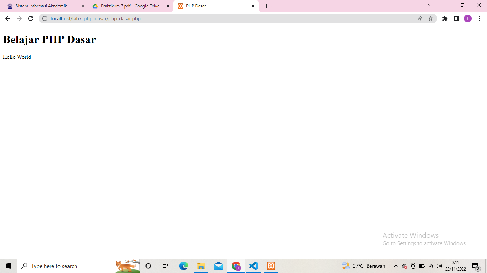
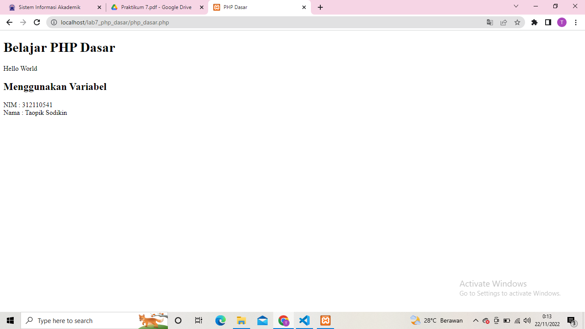
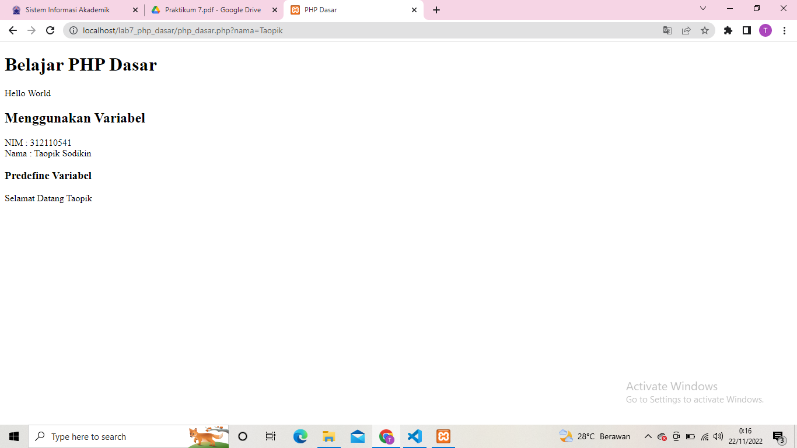
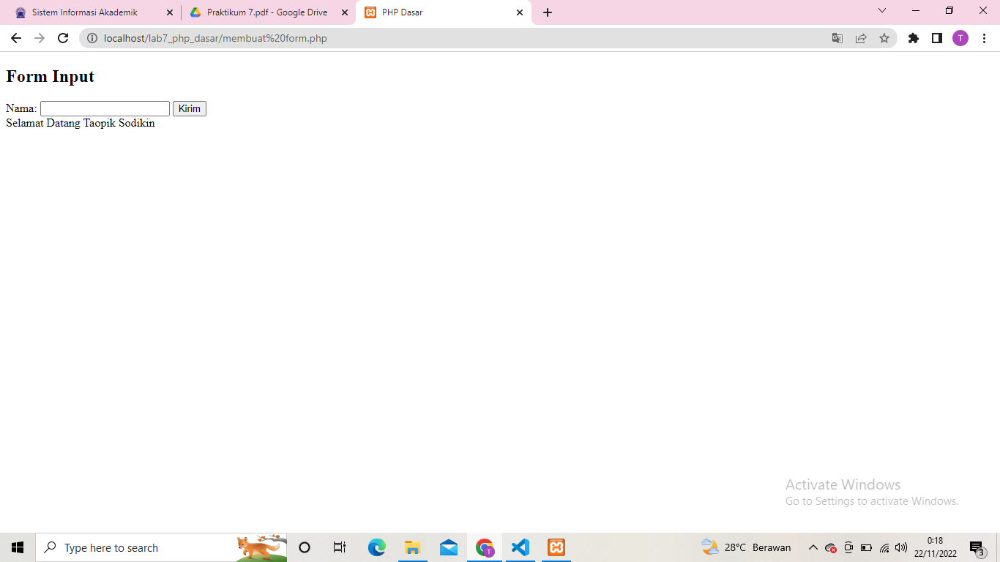
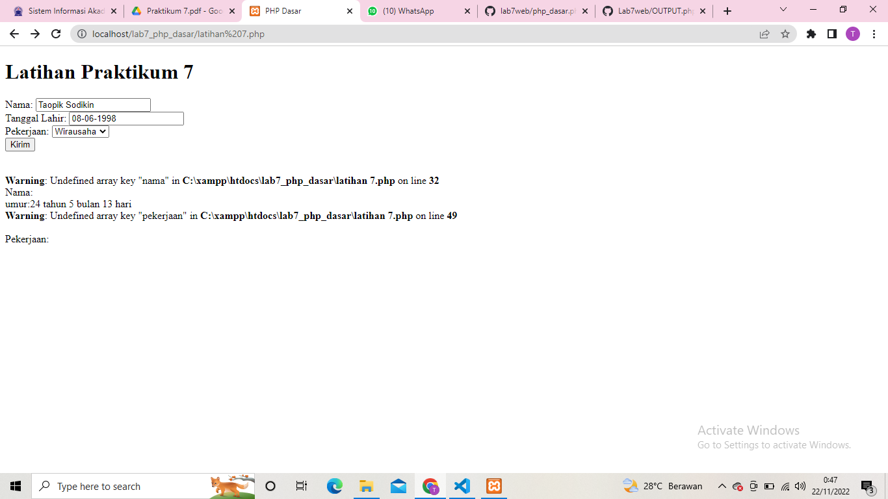
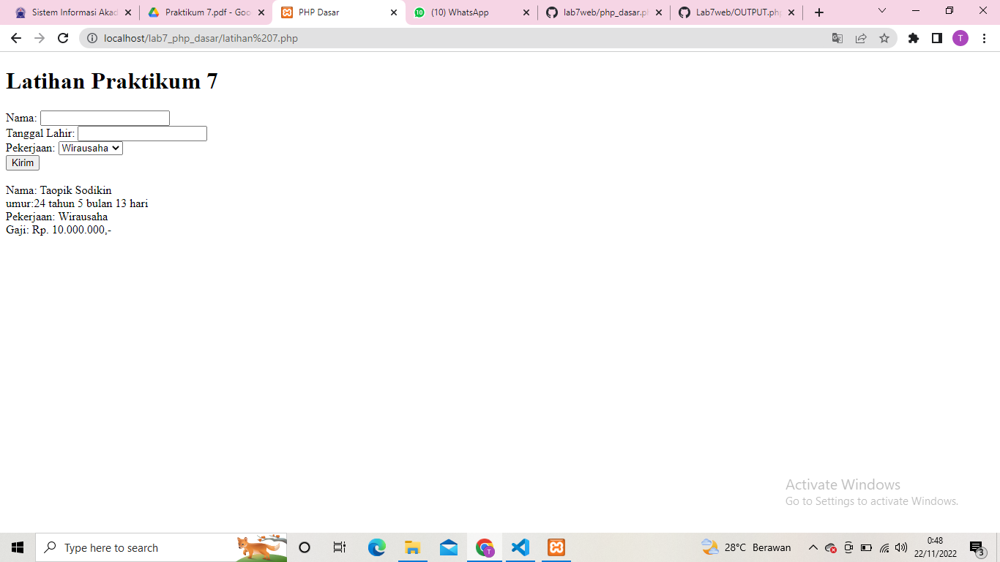

# Lab7Web

## PHP Dasar

### Membuat file PHP Dasar
Sebelum membuat file maka terlebih dahulu mendownload xampp dan aktifkan apache-nya.
Lalu membuat variable pada program.

### Membuat Form Input

### Membuat Operator, Kondisi IF dan Switch, Perulangan For, While, dan Dowhile
1[Gambar 5](Folder/SS5.png)

### Latihan 7
Membuat program sederhana dengan menggunakan form input

